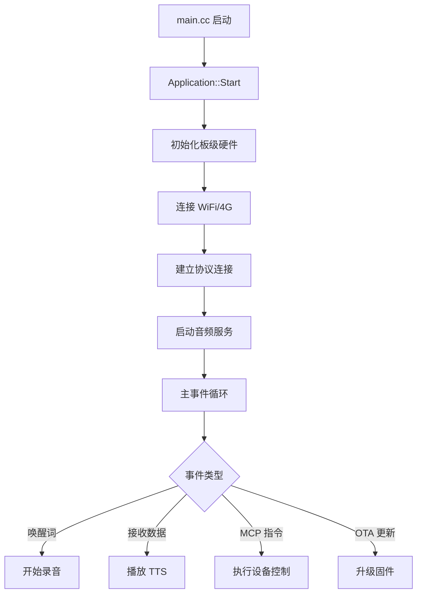

# `main/` 文件夹架构分析

这是一个**模块化的嵌入式 AI 聊天机器人固件架构**，采用 **C++** 开发，基于 **ESP-IDF** 框架。

---

## 📁 核心架构层次

```
main/
├─ 🎯 核心控制层
├─ 🔊 音频处理层
├─ 📺 显示驱动层
├─ 🔌 硬件抽象层（70+ 板级支持包）
├─ 🌐 通信协议层
├─ 💡 外设控制层
└─ 📦 资源管理层
```

---

## 🎯 一、核心控制层

| 文件                     | 作用         | 关键功能                                                     |
| ------------------------ | ------------ | ------------------------------------------------------------ |
| **`main.cc`**            | 程序入口     | • 初始化 NVS、事件循环<br>• 启动 Application 单例            |
| **`application.cc/h`**   | 应用主控制器 | • 事件驱动主循环<br>• 设备状态管理<br>• 协调各模块交互<br>• 任务调度 |
| **`mcp_server.cc/h`**    | MCP 服务器   | • 实现 MCP 协议<br>• 设备控制接口（音量、LED、GPIO 等）<br>• 接收云端/本地 MCP 指令 |
| **`ota.cc/h`**           | OTA 升级管理 | • 固件更新<br>• 版本检查<br>• 回滚机制                       |
| **`settings.cc/h`**      | 设置管理     | • 持久化配置<br>• NVS 存储                                   |
| **`system_info.cc/h`**   | 系统信息     | • 设备信息查询<br>• 硬件状态监控                             |
| **`device_state*.cc/h`** | 设备状态     | • 状态机管理<br>• 状态变化事件                               |
| **`assets.cc/h`**        | 资源管理     | • 音频资源<br>• 配置文件<br>• 字体、表情包                   |

### 核心设计模式
- ✅ **单例模式**：`Application::GetInstance()`
- ✅ **事件驱动**：FreeRTOS Event Groups
- ✅ **任务调度**：`Schedule()` 回调队列
- ✅ **状态机**：`DeviceState` 枚举

---

## 🔊 二、音频处理层 (`audio/`)

采用**三层架构**：音频编解码 → 音频处理 → 唤醒词检测

### 子模块结构

```
audio/
├─ audio_service.cc/h        # 音频服务总控
├─ audio_codec.cc/h          # 编解码器抽象接口
├─ audio_processor.h         # 音频处理器接口
├─ wake_word.h               # 唤醒词接口
├─ codecs/                   # 🎤 音频编解码器实现
│   ├─ es8311_audio_codec.cc # ES8311 芯片驱动
│   ├─ es8388_audio_codec.cc # ES8388 芯片驱动
│   ├─ box_audio_codec.cc    # ESP-BOX 音频
│   ├─ dummy_audio_codec.cc  # 虚拟编解码（测试用）
│   └─ no_audio_codec.cc     # 无音频设备
├─ processors/               # 🔧 音频处理器
│   ├─ afe_audio_processor.cc # AFE (Audio Front End) 降噪、AEC
│   ├─ audio_debugger.cc      # 音频调试器（UDP 发送）
│   └─ no_audio_processor.cc  # 无处理器
└─ wake_words/               # 👂 唤醒词检测
    ├─ afe_wake_word.cc      # AFE + Wakenet
    ├─ custom_wake_word.cc   # Multinet 自定义唤醒词
    └─ esp_wake_word.cc      # 纯 Wakenet（无 AFE）
```

### 设计亮点
- 🎨 **策略模式**：不同芯片/算法可插拔替换
- 🔄 **支持 AEC**：设备端/服务端回声消除
- 🎵 **OPUS 编码**：实时音频流传输

---

## 📺 三、显示驱动层 (`display/`)

支持 **OLED** 和 **LCD** 两大类显示屏

```
display/
├─ display.h                 # 显示器抽象接口
├─ oled_display.cc/h         # OLED 单色屏（SSD1306、SH1106）
├─ lcd_display.cc/h          # LCD 彩屏（ST7789、ILI9341 等）
├─ emote_display.cc/h        # 表情动画显示
└─ lvgl_display/             # 🎨 LVGL 图形库封装
    ├─ lvgl_display.cc/h     # LVGL 初始化
    ├─ lvgl_font.cc/h        # 多语言字体
    ├─ lvgl_image.cc/h       # 图片渲染
    ├─ emoji_collection.cc/h # 表情包管理
    ├─ lvgl_theme.cc/h       # 主题样式
    ├─ gif/                  # GIF 动画支持
    └─ jpg/                  # JPEG 图片支持
```

### 特性
- 🌍 **多语言支持**：17+ 种语言（中文、英文、日文等）
- 🎭 **表情显示**：ChatGPT 风格聊天界面
- 📱 **触摸支持**：部分板子支持触摸屏

---

## 🔌 四、硬件抽象层 (`boards/`)

这是项目最复杂的部分，支持 **70+ 个不同的开发板**

### 目录结构

```
boards/
├─ common/                   # 🔧 通用硬件驱动
│   ├─ board.cc/h            # 板级抽象基类
│   ├─ wifi_board.cc/h       # WiFi 板基类
│   ├─ ml307_board.cc/h      # 4G (ML307) 板基类
│   ├─ dual_network_board.cc/h # WiFi+4G 双网板
│   ├─ button.cc/h           # 按钮驱动
│   ├─ knob.cc/h             # 旋钮驱动
│   ├─ backlight.cc/h        # 背光控制
│   ├─ camera.h              # 摄像头接口
│   ├─ esp32_camera.cc/h     # ESP32 摄像头
│   ├─ power_save_timer.cc/h # 省电定时器
│   ├─ sleep_timer.cc/h      # 睡眠定时器
│   ├─ adc_battery_monitor.cc/h # 电池电量监控
│   ├─ axp2101.cc/h          # AXP2101 电源管理芯片
│   ├─ sy6970.cc/h           # SY6970 充电芯片
│   └─ afsk_demod.cc/h       # 声波配网解调
├─ bread-compact-wifi/       # 面包板 WiFi 版
├─ esp-box-3/                # 乐鑫 ESP-BOX-3
├─ m5stack-core-s3/          # M5Stack CoreS3
├─ magiclick-2p4/            # 神奇按钮 2.4
├─ xmini-c3/                 # 虾哥 Mini C3
├─ lichuang-dev/             # 立创·实战派
├─ sensecap-watcher/         # SenseCAP Watcher
└─ ... (70+ 个板子)
```

### 每个板子包含

| 文件           | 作用                               |
| -------------- | ---------------------------------- |
| `xxx_board.cc` | 板级初始化代码                     |
| `config.h`     | 硬件配置（GPIO、I2C、SPI 等）      |
| `config.json`  | 板子元数据（名称、作者、引脚定义） |
| `README.md`    | 使用说明（可选）                   |

### 设计理念
- 🏗️ **继承体系**：`Board` → `WifiBoard` / `ML307Board`
- 🔌 **统一接口**：所有板子实现相同的接口
- ⚙️ **配置驱动**：通过 `Kconfig.projbuild` 选择板型

---

## 🌐 五、通信协议层 (`protocols/`)

支持两种通信协议

```
protocols/
├─ protocol.cc/h             # 协议抽象基类
├─ websocket_protocol.cc/h   # WebSocket 协议
└─ mqtt_protocol.cc/h        # MQTT + UDP 混合协议
```

### 协议对比

| 特性         | WebSocket  | MQTT+UDP   |
| ------------ | ---------- | ---------- |
| 实时性       | ⭐⭐⭐⭐       | ⭐⭐⭐⭐⭐      |
| 低延迟音频   | ✅          | ✅ (UDP)    |
| 服务器复杂度 | 低         | 中         |
| 适用场景     | 官方服务器 | 自建服务器 |

---

## 💡 六、外设控制层 (`led/`)

LED 灯效控制

```
led/
├─ led.h                    # LED 抽象接口
├─ gpio_led.cc/h            # GPIO 单色 LED
├─ single_led.cc/h          # 单 LED 控制
└─ circular_strip.cc/h      # WS2812B 环形灯带
```

---

## 📦 七、资源管理层 (`assets/`)

包含 **379 个资源文件**：

- 🔊 **音频文件** (357个 `.ogg`)：提示音、数字语音、唤醒音等
- 📝 **配置文件** (22个 `.json`)：语言配置、表情配置等

---

## ⚙️ 八、配置系统

### 1. **`CMakeLists.txt`** (817 行)
- 动态包含选定的板级文件
- 根据 Kconfig 条件编译不同模块
- 资源文件嵌入（`.ogg` → `.S` 汇编）

### 2. **`Kconfig.projbuild`** (691 行)
- 📋 **板型选择** (392 个选项)
- 🌍 **语言选择** (17 种语言)
- 🎤 **唤醒词模式** (无/AFE/自定义)
- 📺 **显示屏类型**
- 🔊 **音频调试**
- 📷 **摄像头配置**

### 3. **`idf_component.yml`**
- 外部组件依赖声明（LVGL、ESP-SR、Opus 等）

---

## 🏗️ 核心工作流程



---

## 🎯 架构优势

| 特性             | 说明                           |
| ---------------- | ------------------------------ |
| ✅ **高可扩展性** | 新增板子只需添加一个文件夹     |
| ✅ **模块解耦**   | 音频、显示、网络独立可测       |
| ✅ **配置驱动**   | Kconfig 菜单化配置，无需改代码 |
| ✅ **策略模式**   | 编解码器、处理器、协议可插拔   |
| ✅ **单例模式**   | Application 全局唯一控制中心   |
| ✅ **事件驱动**   | FreeRTOS 异步事件响应          |

---

## 🔑 关键技术点

1. **FreeRTOS 多任务**：主任务 + 音频任务 + 网络任务
2. **C++ RAII**：自动资源管理（互斥锁、定时器）
3. **模板方法模式**：Board 基类定义流程，子类实现细节
4. **ESP-IDF 组件系统**：依赖管理和版本控制
5. **LVGL 9.3**：现代化 GUI 框架
6. **ESP-SR**：乐鑫语音识别库（唤醒词 + 降噪）

---

这是一个**企业级的嵌入式系统架构**，充分体现了模块化、可维护性和可扩展性的设计理念！🚀